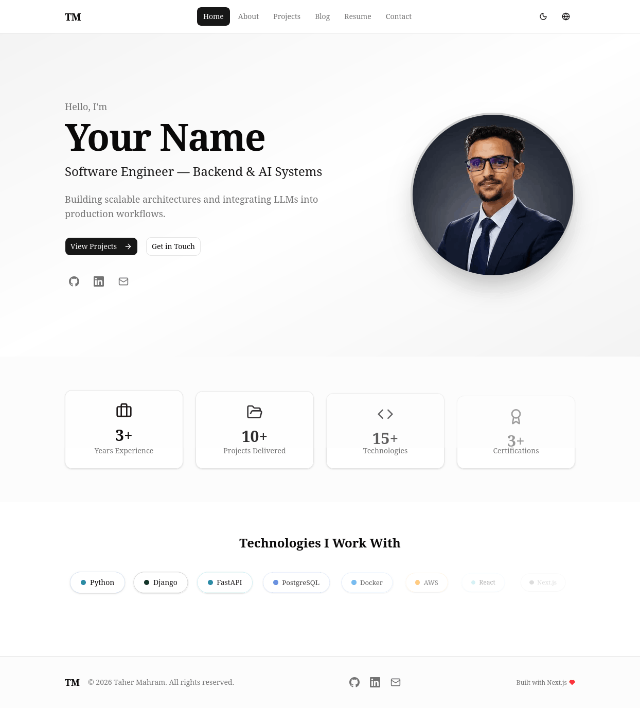
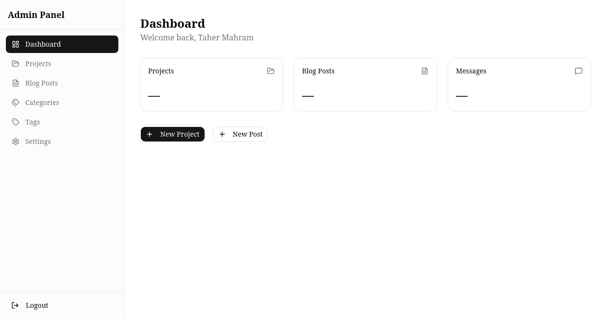
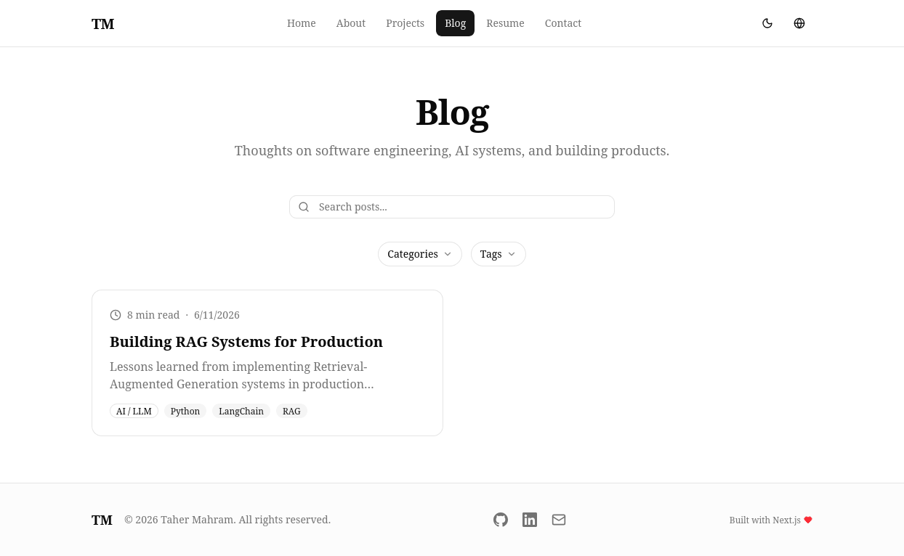
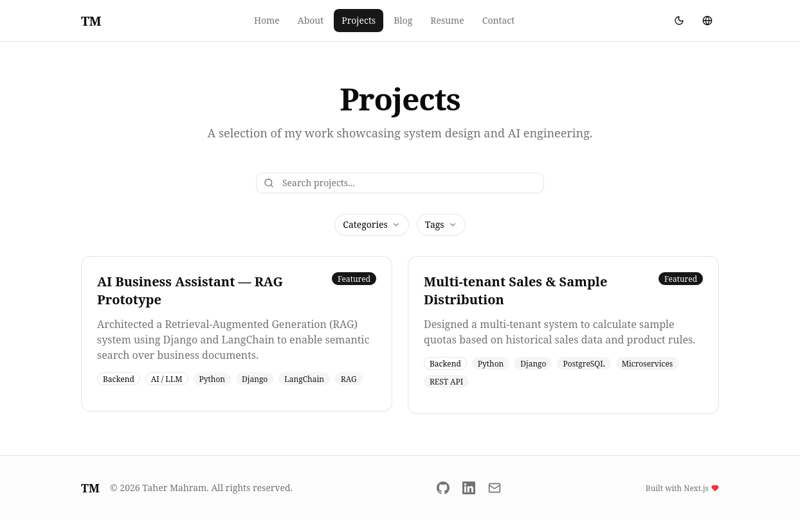
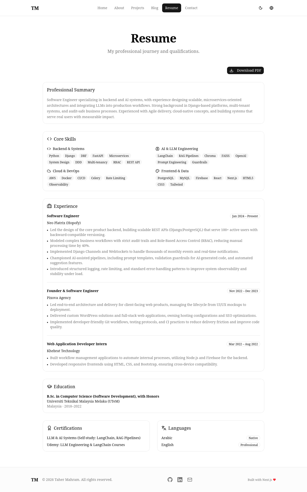
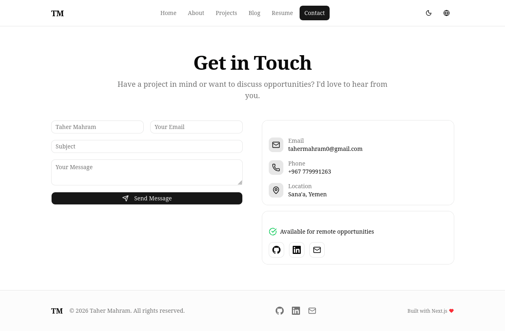

# Portfolio & Career Website

A production-ready, bilingual (English + Arabic) portfolio and CMS template built with Next.js 16. Fork it, customize it, deploy it.

[](https://github.com/dev-taherm/my-profile-oc/actions/workflows/ci.yml)
[](https://opensource.org/licenses/MIT)
[](https://nextjs.org)
[](https://typescriptlang.org)
[](CONTRIBUTING.md)

---

## Demo

| Homepage | Admin Dashboard | Blog |
|---|---|---|
|  |  |  |

| Projects | Resume | Contact |
|---|---|---|
|  |  |  |

---

## Quick Start

```bash
git clone -b main-sqlite https://github.com/dev-taherm/my-profile-oc.git
cd my-profile-oc
pnpm install
cp .env.example .env
pnpm db:generate && pnpm db:push && pnpm db:seed
pnpm dev
```

Open [http://localhost:3000/en](http://localhost:3000/en)

---

## Features

| Feature | Description |
|---|---|
| **Bilingual** | Full English + Arabic support with automatic RTL/LTR switching |
| **Admin Dashboard** | Manage projects, blog, services, media, and settings |
| **AI Content Agent** | Multi-provider AI (Ollama, OpenAI, Claude, Google) for content generation |
| **SEO Optimized** | Sitemap, robots.txt, OG images, structured data, hreflang |
| **Analytics** | Built-in page view tracking with dashboard |
| **Media Library** | Folder organization, drag-and-drop upload, WebP conversion |
| **Dark/Light Mode** | Theme toggle with system preference detection |
| **Responsive** | Mobile-first design with Tailwind CSS |
| **Docker Ready** | Multi-stage build with PostgreSQL support |
| **Database** | SQLite (dev) or PostgreSQL (prod) via Prisma ORM |

---

## Tech Stack

Next.js 16, TypeScript, React 19, Tailwind CSS 4, shadcn/ui, Prisma, NextAuth.js, Framer Motion, Docker

---

## Documentation

- **[Installation Guide](#quick-start)** - Setup in under 2 minutes
- **[Contributing](CONTRIBUTING.md)** - How to contribute
- **[Changelog](CHANGELOG.md)** - Release history
- **[Security Policy](SECURITY.md)** - Vulnerability reporting
- **[Code of Conduct](CODE_OF_CONDUCT.md)** - Community guidelines

---

## Project Structure

```
src/
  app/           # Pages and API routes
  components/    # React components
  lib/           # Utilities
  i18n/          # Translations
prisma/          # Database schema
```

---

## Roadmap

- [x] Bilingual support (EN/AR)
- [x] Admin dashboard
- [x] AI content agent
- [x] Media library
- [x] Analytics
- [x] Docker deployment
- [ ] Unit tests (Vitest)
- [ ] E2E tests (Playwright)
- [ ] Documentation website (Mintlify)
- [ ] Plugin system
- [ ] Multi-tenant support
- [ ] GraphQL API

---

## Contributing

Contributions are welcome! See [CONTRIBUTING.md](CONTRIBUTING.md) for details.

---

## License

MIT License - see [LICENSE](LICENSE)

---

## Author

**Taher Mahram** - [GitHub](https://github.com/dev-taherm) - [Portfolio](https://taher.dev)
